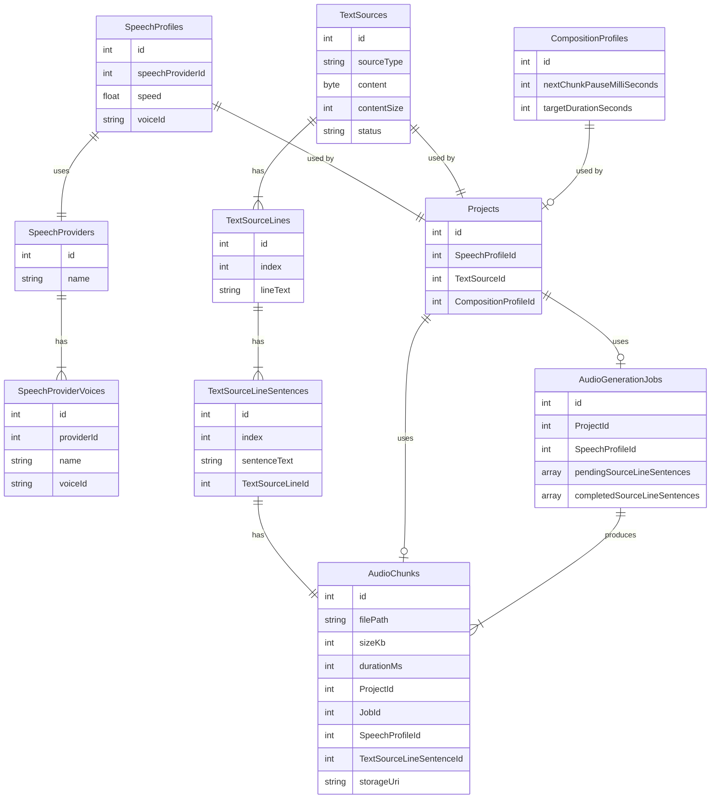

```mermaid
erDiagram
    SpeechProviders {
        int id
        string name
    }

    SpeechProviderVoices {
        int id
        int providerId
        string name
        string voiceId
    }

    SpeechProviders ||--|{ SpeechProviderVoices : "has"

    SpeechProfiles {
        int id
        int speechProviderId
        float speed
        string voiceId
    }

    SpeechProfiles ||--|| SpeechProviders   : "uses"
    SpeechProfiles ||--|| Projects : "used by"

    TextSources {
        int id
        string sourceType
        byte content
        int contentSize
        string status
    }

    TextSources ||--|| Projects : "used by"

    TextSourceLines {
        int id
        int index
        string lineText
    }

    TextSources ||--|{ TextSourceLines : "has"

    TextSourceLineSentences {
        int id
        int index
        string sentenceText
        int TextSourceLineId
    }

    TextSourceLines ||--|{ TextSourceLineSentences : "has"

    Projects {
        int id
        int SpeechProfileId
        int TextSourceId
        int CompositionProfileId
    }

    AudioChunks {
        int id
        string filePath
        int sizeKb
        int durationMs
        int ProjectId
        int JobId
        int SpeechProfileId
        int TextSourceLineSentenceId
        string storageUri
    }

    TextSourceLineSentences ||--|| AudioChunks : "has"

    Projects ||--o| AudioChunks : "uses"

    CompositionProfiles {
        int id
        int nextChunkPauseMilliSeconds
        int targetDurationSeconds
    }

    CompositionProfiles ||--o| Projects : "used by"

    AudioGenerationJobs {
        int id
        int ProjectId
        int SpeechProfileId
        array pendingSourceLineSentences
        array completedSourceLineSentences
    }

    Projects ||--o| AudioGenerationJobs : "uses"
    AudioGenerationJobs ||--|{ AudioChunks : "produces"
```
